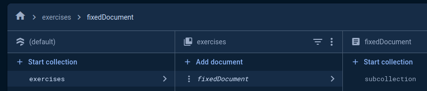
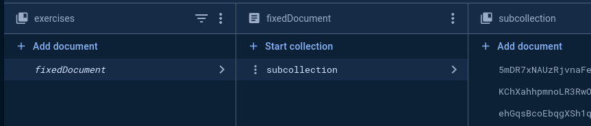

# Firebase Firestore - Titanium Module

Use the native Firebase SDK in Titanium. This repository is part of the [Titanium Firebase](https://github.com/hansemannn/titanium-firebase) project.

## Methods:

* <b>addDocument</b>({callback[function], collection[string], data[object]})
* <b>addDocument</b>({callback[function], collection[string], subcollection[string, Android only], document[string], data[object]})
* <b>getDocuments</b>({callback[function], collection[string])
* <b>getDocument</b>({callback[function], collection[string], document[string])
* <b>updateDocument</b>({callback[function], collection[string], document[string], data[object]})
* <b>deleteDocument</b>({callback[function], collection[string], document[string]})

#### Add document

You can store items with a automatic generated document ID:
```js
TiFirestore.addDocument({
  collection: "data",
  data: {
    key: value
  },
  callback: function(data) {
    console.log("saved to 'data/" + data.documentID + "'")
  }
});
```

or by using a fixed document name:

```js
TiFirestore.addDocument({
  collection: "data",
  document: "fixedDocument",
  data: {
    key: value
  },
  callback: function(data) {
    console.log("saved to 'data/fixedDocument'")
  }
});
```

##### Subcollections:
<b>Android</b> allows you to store a subcollection like this `exercises/fixedDocument/subcollection/*`:




```js
TiFirestore.addDocument({
  collection: "exercises",
  document: "fixedDocument",
  subcollection: "subcollection",
  data: {
    date: $.picker.value,
    sets: $.tf_repeat.value,
    weight: $.tf_weight.value
  },
  callback: function(data) {
    console.log("saved to 'exercises/fixedDocument/subcollection/" + data.documentID + "'")
  }
});
```
This will store automatic generated documentIDs into the subcollection.

#### Read documents

To get the data back you can use `getDocuments()` or `getDocument()`. This example will read all documents from `/data/*`:
```js
TiFirestore.getDocuments({
  collection: 'data',
  callback: event => {
    if (!event.success) {
      console.error('Could not read Firestore:', event.error);
      return;
    }

    console.log(event.documents);
  }
})
```

<b>Android:</b> To read a subcollection `data/fixedDocument/subcollection/*` you can do
```js
TiFirestore.getDocuments({
  collection: 'data',
  document: 'fixedDocument',
  subcollection: 'subcollection',
  callback: event => {
    if (!event.success) {
      console.error('Could not read Firestore:', event.error);
      return;
    }

    console.log(event.documents);
  }
})
```

## Supporting this effort

The whole Firebase support in Titanium is developed and maintained by the community (`@hansemannn` and `@m1ga`). To keep
this project maintained and be able to use the latest Firebase SDK's, please see the "Sponsor" button of this repository,
thank you!

## Requirements

-   [x] The [Firebase Core](https://github.com/hansemannn/titanium-firebase-core) module
-   [x] Titanium SDK 9.2.0+

## Example

See the [example/app.js](./example/app.js) for details!

## Build

```js
cd ios
ti build -p ios --build-only
```

## Author

Hans Knöchel

## Legal

This module is Copyright (c) 2022-present by Hans Knöchel, Inc. All Rights Reserved.
